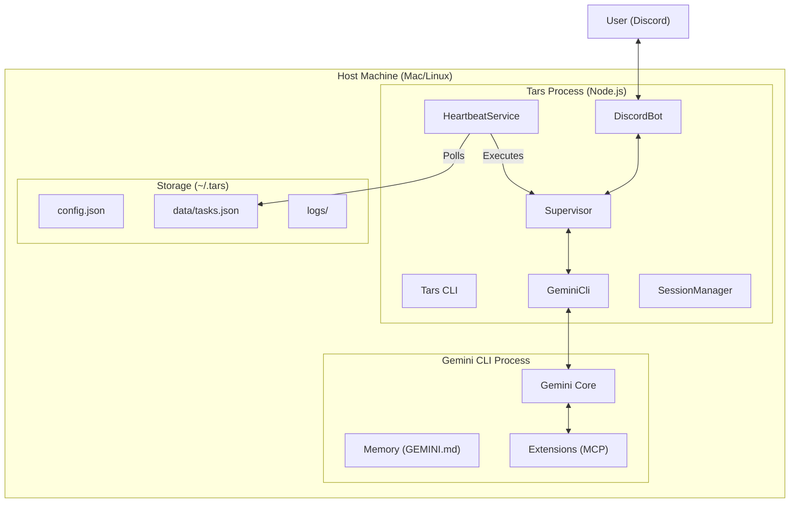

# Tars Architecture

Tars is a bare-metal, autonomous personal assistant designed to run natively on your machine. Unlike its predecessor (Apex), Tars eschews Docker and complex container orchestration in favor of a lightweight, process-based architecture that leverages the native capabilities of the underlying OS and the Gemini CLI.

## High-Level Overview

Tars operates as a **Supervisor** process that orchestrates interactions between the user (via Discord), the AI brain (Gemini CLI), and the local system (Extensions).

## Core Components

### 1. Supervisor (`src/supervisor/Supervisor.ts`)

The central nervous system of Tars. It is a lightweight orchestrator that:

- Manages the lifecycle of Gemini CLI sessions.
- Handles concurrent requests from Discord.
- executes background tasks triggered by the Heartbeat service.
- Tracks session usage and token counts.

### 2. Gemini CLI Wrapper (`src/supervisor/GeminiCli.ts`)

A dedicated wrapper around the `gemini` command-line tool. It handles:

- Spawning the `gemini` child process.
- Streaming `stdout`/`stderr` events in real-time.
- managing session persistence via the `--session` flag.
- Injecting extensions via the `--extension` flag.

### 3. Heartbeat Service (`src/supervisor/HeartbeatService.ts`)

The autonomic nervous system. It runs in the background and:

- Polls `~/.tars/data/tasks.json` every minute (configurable).
- Evaluates cron schedules using `cron-parser`.
- Triggers task execution via the Supervisor when a task is due.
- Updates task status (last run, next run, failure count) atomically.

### 4. Discord Bot (`src/discord/DiscordBot.ts`)

The primary interface for user interaction. It:

- Listens for messages mentioning `@Tars` or starting with `!tars`.
- Routes user prompts to the Supervisor.
- Streams responses back to Discord in chunks to handle long-form content.
- Provides a "typing" indicator to signal activity.

## Data Storage

Tars uses two distinct home directories to maintain separation of concerns:

### `~/.tars/`

Stores Tars-specific operational data:

- **`config.json`**: Core settings (Discord token, Model ID, Heartbeat interval).
- **`data/tasks.json`**: The persistent store for scheduled tasks.
- **`data/session.json`**: Session metadata and token usage stats.

### `~/.gemini/`

Stores the "Brain" (managed natively by Gemini CLI):

- **`GEMINI.md`**: The core personality and long-term memories.
- **`extensions/`**: Installed MCP extensions (including the built-in `tars-tasks`).
- **`history/`**: Raw conversation logs handled by Gemini.

## Extension System

Tars leverages the Model Context Protocol (MCP) to extend its capabilities.

- **Built-in Extensions**: `extensions/tasks/` is a TypeScript-based MCP server compiled and shipped with Tars. It provides tools like `create_task`, `list_tasks`, etc.
- **User Extensions**: Tars can write its own extensions at runtime. These are typically plain JavaScript files created in `~/.gemini/extensions/` using the `create-extension` skill.

## Design Philosophy

1.  **Native & Portable**: Tars runs where you run. No containers to manage. The "Brain" is just a directory of files that can be tarballed and moved.
2.  **Transparent**: Everything Tars does is visible in `~/.tars/logs` or standard output. Its memory is a readable Markdown file.
3.  **Self-Modifying**: Tars is aware of its own extension system and can write new code to upgrade itself without a rebuild.
