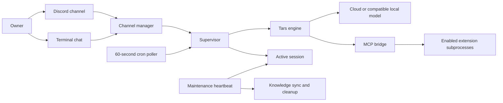

# Tars architecture

Tars is a bare-metal Node.js application. PM2 manages the long-running supervisor; the CLI is the
operator interface around setup, lifecycle, logs, secrets, backup, and maintenance commands.

## Runtime model


```mermaid
flowchart LR
    User["Owner"] --> Discord["Discord channel"]
    User --> TUI["Terminal chat"]
    Discord --> Channels["Channel manager"]
    TUI --> Channels
    Channels --> Supervisor["Supervisor"]
    Supervisor --> Engine["Tars engine"]
    Engine --> Provider["Cloud or compatible local model"]
    Engine --> Bridge["MCP bridge"]
    Bridge --> Extensions["Enabled extension subprocesses"]
    Supervisor --> Session["Active session"]
    Cron["60-second cron poller"] --> Supervisor
    Heartbeat["Maintenance heartbeat"] --> Session
    Heartbeat --> Memory["Knowledge sync and cleanup"]
```

There is one active agent and one active-session history. Tars does not currently create or route
work to sub-agents.

## Components

### CLI and PM2

`src/cli/` implements the `tars` command. `tars start` launches the compiled supervisor through PM2
with `TARS_SUPERVISOR_MODE=true`. The guard prevents an accidental direct production launch. Local
development uses `npm run dev`.

New supervisor and dashboard processes carry `TARS_MANAGED_PROCESS=true` and an explicit
`TARS_PROCESS_KIND`. Lifecycle discovery requires that identity and a canonical `TARS_HOME`; only
narrow executable/cwd/name signatures recognize processes created by older Tars releases. An
unrelated PM2 application that merely inherits `TARS_HOME` is never lifecycle-managed as Tars.

The default PM2 process is `tars-supervisor`. A custom `--name` can start another process, but not all
convenience commands are fully instance-aware. Multi-instance operators must isolate `TARS_HOME` and
manage named processes directly.

### Channels

`src/channels/` contains Discord and terminal adapters. The channel manager normalizes inbound
messages and routes streaming output back to the source.

Discord messages are accepted only from the preconfigured owner ID. With no owner ID, every inbound
Discord message is ignored; direct and guild messages never establish or replace trust. An explicit
`channels.discord.enabled: false` takes precedence over a configured token. Attachments are copied
into local temporary storage only after source URL, filename, declared and streamed size, download
time, and destination checks.

`tars chat --no-discord` runs a foreground terminal session without connecting Discord or
starting daemon-only heartbeat, cron, and dashboard services. It must be started after `tars stop`.
Startup serialization and a cross-process home lease enforce single ownership; the lease remains
held until TUI or signal shutdown. Home-mutating CLI operations refuse the live lease, and a lease
whose owner process predates the current boot or no longer exists is recovered automatically.

### Supervisor

`src/supervisor/supervisor.ts` serializes work against the active session, sends prompts to the
engine, emits progress, and refreshes the system instructions after durable memory changes.
Scheduled tasks execute through this same supervised path. A task in `notify` mode sends its result
to the owner; `silent` records execution without a notification.

### Engine and sessions

`src/supervisor/tars-engine.ts` adapts the Pi Agent SDK event stream, tools, usage, and history to
Tars. `SessionManager` persists active-session metadata and coordinates token-aware compression.
Compression is explicit-session, atomic, and leaves the original history intact if summary
generation fails.

Conversation history lives under `~/.tars/chats/`; session metadata lives in
`~/.tars/data/session.json`. Idle cleanup targets chat history, not the active-session metadata.

### Heartbeat and cron

These are separate services:

- The heartbeat runs on the configured interval and performs maintenance: stale-lock checks,
  attachment cleanup, idle handling, and at-most-hourly memory synchronization. It never releases a
  lock whose work is still running.
- The cron service polls every 60 seconds and runs only explicit one-time or cron-scheduled tasks.
  It does not use an ephemeral agent session and it does not invent work.

### MCP bridge

`src/supervisor/mcp-bridge.ts` discovers manifests under `~/.tars/extensions/` and maps MCP schemas
to agent tools. `extension-enablement.json` is a strict allowlist: a missing or invalid file disables
all extensions. Bootstrap adds missing entries for bundled extensions while preserving explicit
disablement; custom directories are never silently authorized.

Each manifest server may specify `cwd`, `envAllowlist`, `startupTimeoutMs`, and `toolTimeoutMs`.
Subprocesses receive a minimal runtime environment, explicitly allowlisted host variables, and
manifest-defined values. Tool names remain raw when unique; collisions receive deterministic
extension namespaces.

The CLI exposes the same trust-boundary checks through `tars extensions audit` and the transactional
`tars extensions migrate` workflow. Migration suggestions come from a bounded static scan for
`process.env` references; the operator remains responsible for the final allowlist. `tars restart`
runs this review before restarting, while non-interactive restarts fail closed when a decision is
required.

Updates stage the target package before installation and run its versioned, structured preflight in
a separate Node process with a minimal environment and JSON-only output. This lets a new release
report configuration blockers that the currently installed release did not know about without
exposing exported credentials to preflight. A blocked preflight leaves both the global package and
Tars workspace unchanged.

Extensions are trusted local code and are not sandboxed.

## Configuration and state

Runtime state is rooted at `TARS_HOME`, which defaults to `~/.tars/`:

```text
~/.tars/
├── config.json
├── .env
├── settings.json
├── system.md
├── skills/
├── extensions/
│   └── extension-enablement.json
├── chats/
├── tmp/
├── logs/
└── data/
    ├── tasks.json
    ├── session.json
    ├── knowledge.db
    └── memory/
        ├── facts.json
        └── notes/
```

Precedence is exported environment, `~/.tars/.env`, `config.json`, then defaults. Exported values
are not overwritten when the secrets file loads. External configuration is schema-validated and
numeric settings are bounded.

Durable task writes use cross-process locking and atomic replacement. Backup imports and package
refreshes stage and validate their inputs, then use an atomic swap with rollback.

## Trust boundaries

- Tars has the authority of its OS user; it is not a command or filesystem sandbox.
- Model-provider traffic leaves the host unless a local endpoint is configured.
- MCP extensions and skills are trusted operator-installed code and instructions.
- Log/event redaction limits common secret exposure, but is not comprehensive DLP.
- Public web fetches reject non-HTTP schemes and private or loopback destinations and enforce
  redirect, response-size, and time limits.
- The optional dashboard is disabled by default, binds to loopback, and requires a non-default
  password of at least 16 characters. Its file endpoints use containment and credential-file checks.

See the [security documentation](../site/src/pages/capabilities/security.md) for operational
guidance and explicit limitations.
