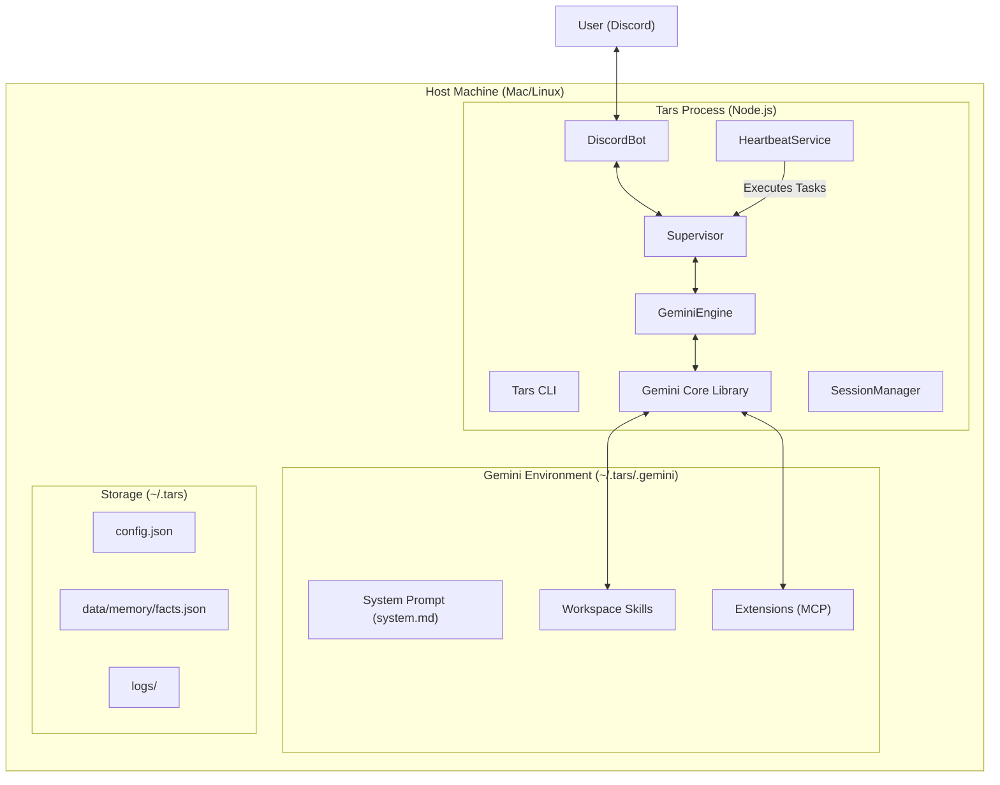

# Tars Architecture

Tars is a bare-metal, autonomous personal assistant designed to run natively on your machine. It operates as a lightweight, process-based application that leverages the direct Node.js integration of the Gemini CLI Core library.

## High-Level Overview

Tars operates as a **Supervisor** process that orchestrates interactions between the user (via Discord), the AI brain (Gemini Native Core), and the local system (Extensions/Skills).

```mermaid
graph TB
    subgraph "Host Machine (Mac/Linux)"
        subgraph "Tars Process (Node.js)"
            CLI["Tars CLI"]
            DB["DiscordBot"]
            SV["Supervisor"]
            GE["GeminiEngine"]
            CORE["Gemini Core Library"]
            SM["SessionManager"]
            HB["HeartbeatService"]
        end

        subgraph "Gemini Environment (~/.tars/.gemini)"
            Prompt["System Prompt (system.md)"]
            Skills["Workspace Skills"]
            Ext["Extensions (MCP)"]
        end

        subgraph "Storage (~/.tars)"
            Config["config.json"]
            Memory["data/memory/facts.json"]
            Logs["logs/"]
        end
    end

    User["User (Discord)"] <--> DB
    DB <--> SV
    SV <--> GE
    GE <--> CORE
    CORE <--> Ext
    CORE <--> Skills
    HB -- Executes Tasks --> SV
```

## Core Components

### 1. Supervisor (`src/supervisor/supervisor.ts`)

The central nervous system of Tars. It is a lightweight orchestrator that:

- Manages the lifecycle of conversations via `GeminiEngine`.
- Handles concurrent requests from Discord with an execution lock.
- Executes background tasks triggered by the `HeartbeatService`.
- Detects memory mutations and invalidates sessions to ensure fact consistency.

### 2. Gemini Engine (`src/supervisor/gemini-engine.ts`)

A native integration with `@google/gemini-cli-core`. It replaces the old subprocess-based CLI wrapper with direct library calls, providing:

- **Extension Discovery**: Automatically scans and loads MCP extensions from `~/.tars/.gemini/extensions/`.
- **Direct Streaming**: Consumes event streams directly from the Gemini Core without JSON parsing overhead.
- **Session Persistence**: Native handling of session IDs and conversation history.
- **Path Resolution**: Ensures MCP servers can resolve internal paths correctly via `${extensionPath}` substitution.

### 3. Heartbeat Service (`src/supervisor/heartbeat-service.ts`)

The autonomic nervous system. It runs in the background and:

- Performs "Autonomous Health Checks" every 300s (default).
- Triggers the **Full Memory Sync** to index facts into the KnowledgeStore.
- Coordinates background task execution via the Supervisor using ephemeral sessions.

### 4. Discord Bot (`src/discord/DiscordBot.ts`)

The primary interface for user interaction. It:

- Listens for messages mentioning the bot or DMs.
- Routes user prompts and attachments to the Supervisor.
- Streams responses back to Discord in real-time.

## Data Storage

Tars centralizes all data in `~/.tars/` to ensure portability and isolation:

### `~/.tars/`
- **`config.json`**: Core settings (Discord token, Model ID, Heartbeat interval).
- **`data/memory/facts.json`**: Long-term facts stored by the `tars-memory` extension.
- **`logs/`**: Detailed execution logs and tool call history.

### `~/.tars/.gemini/`
- **`system.md`**: The core personality and operating instructions for the AI.
- **`extensions/`**: Integrated MCP extensions (e.g., `tars-tasks`, `tars-memory`).
- **`agents/`**: System-generated sub-agents for specialized tasks.

## Design Philosophy

1.  **Bare-Metal & Native**: Tars runs directly on the host, allowing it to manage files, services, and processes without container boundaries.
2.  **No Subprocess Overhead**: By using the Gemini Core library directly, Tars avoids the latency and fragility of spawning CLI subprocesses.
3.  **Transparent Memory**: Facts are stored in readable JSON/Markdown formats, and all tool interactions are logged for auditing.
4.  **Self-Configuring**: Tars automatically syncs its skills, agents, and extensions during bootstrap, ensuring the environment is always up to date.
